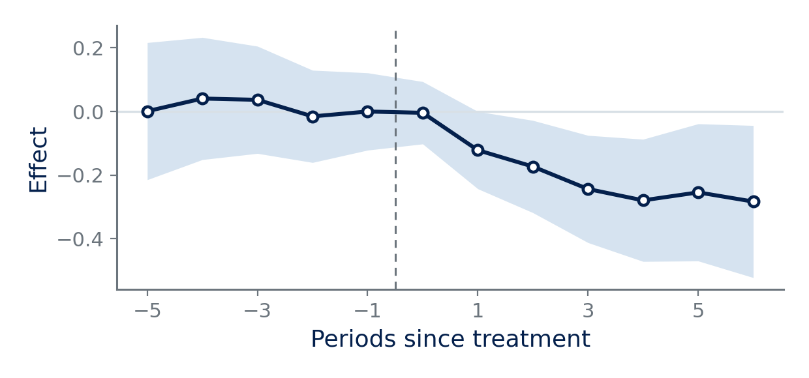

# Dublin — a modernised Beamer template

A modernised Beamer template for academic use: seminars, job talks,
conference papers and lectures. Named the way Beamer names themes.

Write the deck in markdown and Quarto renders it, or write it in LaTeX
directly. The theme is the same either way, and both compile with pdflatex.

**Widescreen by default.** Beamer still opens at 4:3, which letterboxes on
the widescreen projectors and displays now in every room. This is 16:9, and
the layout uses the width rather than just spreading into it: a figure sits beside its
notes, a pair of panels sits side by side, and a four-column regression table
fits without shrinking the type.

For a room that genuinely needs a square screen, override the format —
`aspectratio: 43` under `dublin-beamer` in the front matter, or
`aspectratio=43` in `\documentclass` in plain LaTeX. Nothing else changes:
the boxes, figures and tables are all set in relative units, though a
`\figpair` gets tight and is better split across two slides at 4:3.

```
_extensions/deegan/dublin/
    _extension.yml          format defaults (engine, aspect ratio, filters)
    dublin-theme.tex        palette, type, title slide, frame titles, footer
    dublin-components.tex   takeaway/result/caveat boxes, stats, contributions
    dublin-blocks.lua       maps markdown onto those environments
overleaf/                   the same theme as a plain LaTeX deck, with its
                            own copies of the assets so the folder can be
                            uploaded to Overleaf on its own
showcase.qmd                the preview: every element, with the markdown
                            that produced it beside it
example.qmd                 a talk skeleton to copy and fill in
stress.qmd                  every element at its limit
tests/build.sh              build a deck and check it
tests/check.py              the assertions
examples/                   figure styling for matplotlib and ggplot2,
                            plus the figures the decks use
showcase.pdf, example.pdf   the two decks, already rendered
```

**Write markdown, not LaTeX.** Nearly everything below is reachable through
fenced divs, ordinary lists and ordinary links, so a deck can be written and
edited in Quarto's visual editor. Tables are the exception: a markdown table
works and is styled, but panels, spanning heads and full-width rules need the
`dgtable` environment, which is where that control lives.

Two rules cover nearly all of it:

1. **A box is a div, and every box takes an optional `title=`.**
2. **Anything with several parts is a div wrapping a list.**

| You want | You write |
|---|---|
| A callout box | `::: {.takeaway title="What this changes"}` |
| | also `.result`, `.caveat`, `.defn`, `.worked` |
| Headline numbers | `::: {.stats}` + a bullet list |
| Numbered contributions | `::: {.contributions}` + a numbered list |
| Appendix jump buttons | `::: {.nav}` + a list of links |
| Notes under a table or figure | `::: {.tablenotes}` |
| A contents slide | `::: {.toc}` |
| Closing slide | `::: {.thanks email="..." site="..."}` |
| Appendix divider | `::: {.appendix}` |
| Speaker notes | `::: {.notes}` |

Guessing works. Each box answers to a plain-English alias as well as its
short name — `.key`, `.finding`, `.limitation`, `.definition`, `.example` —
`.toc` also answers to `.outline` and `.contents`, and `.tablenotes` to
`.fignotes`. If a div is written wrongly the render prints a
`[dublin]` line saying what it expected, rather than silently
dropping the content.

## Contents

| | |
|---|---|
| [Start a deck](#start-a-deck) | front matter, aspect ratio, first render |
| [The cover](#the-cover) | photograph, scrim, badge, crest |
| [What you get](#what-you-get) | every element and the markdown for it |
| [Teaching](#teaching) | contents slide, handouts, speaker notes |
| [Testing](#testing) | the stress deck and the conformance checks |
| [Plain LaTeX, and Overleaf](#plain-latex-and-overleaf) | using it without Quarto |
| [Palette](#palette) | the five tokens everything reads from |
| [Figures](#figures) | colour scales and drawing conventions |
| [Requirements](#requirements) | what TeX Live needs to have |
| [Assets and licence](#assets-and-licence) | what you may reuse |

New here? Open `showcase.pdf` first — it shows every element beside the
markdown that produced it. Then copy `example.qmd` and start typing.

## Start a deck

Copy `_extensions/` into your project folder and write the front matter:

```yaml
---
title: "Failure in the Margins"
subtitle: "Local Exposure to Non-local Bank Distress"
short-title: "Failure in the Margins"    # the footer, if the title is long
author: "Sam Deegan"
institute: "University College Dublin"
date: "September 2026"
format: dublin-beamer

cover-photo: cover-dublin.png            # all five optional
cover-badge: Job Market Paper
cover-logo: ucd-crest.png
qr-code: qr-sam-deegan.png
---
```

`quarto render talk.qmd`. Engine is pdflatex — the theme uses the IBM Plex
LaTeX packages rather than fontspec, so it needs no system font install.

`showcase.pdf` is what it looks like out of the box. To make it yours, swap
`cover-photo` and `cover-logo`, then change `dgNavy`, `dgBlue` and `dgGreen`
at the top of `dublin-theme.tex` — every element reads from those three.
`example.qmd` and `stress.qmd` are starting points; delete both once you have
your own deck.

One deck covers a job talk, a conference paper and a lecture; what changes is
which parts you use. Appendix jumps and headline numbers earn their keep in a
seminar, the contents slide and handouts in a lecture.

## The cover

Front matter, not LaTeX. Every line is optional:

```yaml
cover-photo: dublin.jpg         # background photograph
cover-scrim: 0.42               # navy laid over it, 0-1
cover-badge: Job Market Paper   # green badge
cover-logo: ucd-crest.png       # mark, top right
qr-code: qr-sam-deegan.png      # on the closing slide
```

In plain LaTeX the same settings are `\coverphoto{}`, `\coverscrim{}`,
`\coverbadge{}`, `\coverlogo{}` and `\thanksqr{}` in the preamble.

**The crest needs no treatment by default.** On a dark photograph it holds
on its own, and the less done to it the better. Two options exist for a
busier image: `\coverlogovignette` darkens the corner behind it, and
`\coverlogoshadow` drops a soft shadow under it. Both leave the logo edge
untouched. Avoid white keylines or halos round a mark — they read as a bad
cut-out rather than as a glow.

**Two LaTeX passes.** The cover is a `remember picture` overlay, which
needs two runs to position. Quarto's latexmk handles this; a bare
`pdflatex` run will show a blank cover on the first pass.

With no `cover-photo` the cover is flat navy.

The scrim is the one number worth tuning per photograph. 0.42 keeps colour
in a dark image; a brighter photograph needs 0.55 or more before white type
holds. A projector in a lit room eats roughly 10-15% of apparent contrast,
so err heavier for a big lecture theatre than for a screenshot.

`ucd-crest.png` ships with the template: the UCD shield on a transparent
background, cropped from the School of Business lockup so it carries no
school wording. For print, the vector original at
`ucd.ie/t4media/crest-ucd.svg` is sharper.

The closing slide reuses the same photograph and scrim, plus a further 12%
navy so the contact details hold, which bookends the deck.

## What you get

**Structure.** `#` starts a section and triggers a divider slide
automatically; `##` starts a frame. Frame content is top-aligned (`t`), not
vertically centred, so slides read like a document page. Headings are set in
Title Case throughout, matching the papers.

**Boxes.** One shape — a flat wash panel with a coloured bar down the left —
in five colours. The bar colour is the only difference, and every box takes
the same optional `title=`:

```markdown
::: {.takeaway title="What this changes"}
The one thing they should leave with.
:::

::: {.result}
A finding, stated flatly. No title needed.
:::
```

| Box | Bar | For |
|---|---|---|
| `.takeaway` | green | the one thing they should leave with |
| `.result` | blue | a finding, stated flatly |
| `.caveat` | muted | a limitation or an assumption |
| `.defn` | navy | a definition; the title runs inline with the body |
| `.worked` | blue | a worked example |

A fenced code block is set in the same panel with a grey bar, so a syntax
example reads as part of the family rather than as raw output. Nothing to
write: any ```` ``` ```` block is styled automatically.

The Lua filter is what makes those work. Without it pandoc silently drops
the div and prints the body as loose text — worth knowing if you ever copy
the .qmd somewhere without the extension.

**Headline numbers.** A bullet list, bold value first:

```markdown
::: {.stats}
- **0.41 s.d.** the effect at the median
- **1 in 4** attenuation from measurement error
- **62,400** unit-years in the panel
:::
```

Two or three numbers. One is a `\statline`; more than three will not be
legible from the back of a room, so extras are dropped rather than squeezed.

**Numbered contributions.** A numbered list, bold heading first:

```markdown
::: {.contributions}
1. **Interference is estimated, not assumed** Firms enter markets adjacent
   to those they serve, so a footprint is contiguous by construction.
2. **Both sides of the bank–county relationship** Only the market's weight
   in the firm supplies exogeneity.
:::
```

The numbering comes from the list, so reordering the list reorders the
contributions.

**List levels.** One colour scale for both kinds of list, so depth reads the
same whether a list is numbered or not: green, then blue, then muted. Bullets
are a filled green square, a smaller blue square, then a muted en dash;
enumerate is a bold green numeral, a blue letter, then a muted roman.

Three levels is the limit. A fourth stops the build with LaTeX's
`Too deeply nested`. Split the slide instead.

**Appendix navigation.** A list of ordinary markdown links, styled as the
cover badge and pinned to the foot of the frame:

```markdown
::: {.nav}
- [Robustness](#rob)
- [Identification](#ident){.level2}
- [Data construction](#data){.level3}
:::
```

The destination is an ordinary heading id — `## Robustness {#rob}` — so there
is no `\hypertarget` to keep in sync by hand.

A class on the link sets its level:

| Link class | Colour | Use for |
|---|---|---|
| none, or `{.level1}` | green | the slide you most expect to be asked about |
| `{.level2}` | blue | the supporting slide |
| `{.level3}` | navy | background detail |
| `{.back}` | navy | a return, styled as level 3 |

Type is white on all four, so the fill carries the level. Any link takes any
class, so `[Back](#main){.level1}` is green if that suits the slide. The row
is pinned to the foot of the frame, so jumps land in the same place on every
slide.

**Figures.** `\fig{path}{caption}` for one exhibit, `\figpair{a}{capA}{b}{capB}`
for two side by side. Both are content-only, so they work inside a Quarto
`##` frame. Each caption autonumbers — a pair is two exhibits, so `\figpair`
gives you Figure 2 and Figure 3, not one figure in two panels. The source and
the detail go underneath in `\dgnotes{}`, exactly as with a table. Don't fold
the note into the caption.

A plain markdown image works too:

```markdown
{width=76%}
```

The theme bounds these: pandoc emits `height=\textheight` for a markdown
image, which fills the frame and pushes the caption off the slide, so a
`figure` environment shrinks `\textheight` to 50% for its own duration —
enough room for a caption and a notes block beneath.

**Equations are numbered**, like tables and figures. `$$ ... $$` becomes a
numbered `equation` — the number sits bold green at the right margin, and the
counter runs across the whole deck rather than resetting per section. Wrap
the maths in `::: {.nonumber}` for one that should not carry a number.

**Fixed-effects rows.** `\yes` is a check, `\no` an empty cell. Both are
black — colour in a table is reserved for `\hl` and `\hlg`.

**Brand reference.** `\swatch{dgNavy}` prints a colour chip, for a palette
slide inside the deck. `showcase.qmd` has one.

**Tables.** A markdown table is rewritten into the same `dgtable` a
hand-written one gives — full text width, rules edge to edge, bold black
heads, house rule weights — so the two routes are indistinguishable on the
slide. Write the table in markdown unless it needs something `dgtable`
expresses and markdown does not: panels, a spanning head, merged cells, or a
highlighted row. Anything with merged cells is left to pandoc rather than
mangled, and the render says so.

`booktabs` rules, heads and body in black, panels in the
Panel A / Panel B / Panel C house style. Caption above, notes below:

```latex
\tabcaption{Effect of Treatment on the Outcome}
\renewcommand{\arraystretch}{1.0}
\begin{dgtable}{l cccc}
 & \multicolumn{4}{c}{\thead{Dependent Variable: Outcome$_{i,t}$}} \\
\cmidrule{2-5}
 & \multicolumn{2}{c}{\thead{OLS}} & \multicolumn{2}{c}{\thead{IV}} \\
\cmidrule(lr){2-3}\cmidrule(lr){4-5}
 & \thead{(1)} & \thead{(2)} & \thead{(3)} & \thead{(4)} \\
\midrule
\dgpanel{5}{Panel A: Independent Variables}
\hl{Treatment$_{i,t}$} & $0.081$ & $0.115$ & $0.196$ & \hl{$0.188$} \\
                  & (0.027) & (0.031) & (0.058) & (0.064) \\
\midrule
\dgpanel{5}{Panel B: Fixed Effects}
Unit         & \no & \yes & \yes & \yes \\
Year         & \no & \no  & \yes & \yes \\
Region--Year & \no & \no  & \no  & \yes \\
\midrule
\dgpanel{5}{Panel C: Model Summary Statistics}
First-stage $F$ & --- & --- & 38.4 & 27.6 \\
Observations & 62{,}400 & 62{,}400 & 62{,}400 & 62{,}118 \\
\end{dgtable}
\dgnotes{Treatment is instrumented in columns (3) and (4). Standard errors
clustered by unit.}
```

Nested spanners are `\multicolumn` plus `\cmidrule`: one across the dependent
variable, then `(lr)` rules under each estimator, whose trimmed ends keep the
groups apart. Saturating the fixed effects left to right lets a reader follow
what each column adds without going to the notes.

**Every table is a size down from the body text**, however it was written.
`dgtable` sets its own size, and a hook catches the rest — a markdown table
goes through pandoc as a `longtable` or a plain `tabular` and would otherwise
arrive at full body size, which is far too big for a slide: even a small econ
table carries more columns than a line of prose does. Write a markdown table
when you just need rows and figures; reach for `dgtable` when you need panels,
a spanning head, or rules that run the full width.

`dgtable` takes the column spec and stretches to the full text width, so
rules run edge to edge. Type is `\footnotesize`; an optional first argument
overrides it, `\begin{dgtable}[\scriptsize]{l rrr}`, but reach for that only
after trimming rows. A frame carrying a caption, a notes block and a nav row
holds about thirteen body rows at `\footnotesize` — past that, split the
table or move a panel to the appendix. Tightening `\arraystretch` to around
`0.92` just above the table buys a couple more.

Everything is black: `\hl{}` (blue) and `\hlg{}` (green) mark the one row or
cell carrying the argument, and mean nothing if used on more.

`\dgpanel{ncols}{Title}` sets a panel heading and nothing else — put a
`\midrule` above it. (A descriptive-statistics table whose panels each carry
their own column headings wants the rule below instead.) `\dgnotes{}` sets
the notes block under the bottom rule with a bold italic label.

**Captions autonumber.** `\tabcaption{}` above a table and `\figcaption{}`
below a figure step the `table` and `figure` counters, so exhibits come out
as **Table 1:**, **Figure 2:** and so on, in document order. A markdown
figure or a markdown table with a `: Caption` line numbers in the same
sequence and is set the same way, left-aligned at the text margin, so the two
routes are indistinguishable on the slide.

Caption every exhibit, including a markdown table — an uncaptioned one still
takes a number, so skipping it leaves a gap in the sequence. Captions are set
in Title Case, like slide headings. Captions and notes are both black with a
bold label; notes are a separate block underneath, and the source belongs
there rather than in the caption.

**References.** Citations run through citeproc, so a Zotero library works
directly: export the `.bib` with Better BibTeX and point the front matter
at the Zotero style repository for APA 7.

```yaml
bibliography: refs.bib
csl: https://www.zotero.org/styles/apa
```

Then place the list where you want it, rather than letting it fall wherever
pandoc drops it. `showcase.qmd` puts it dead last — after the closing slide and
after the appendix:

```markdown
## References {.allowframebreaks}

::: {#refs}
:::
```

That ordering is deliberate. In a seminar you jump into the appendix from a
nav pill and want the backup slides close behind the closing slide, not on
the far side of a reference list. Citations still have to appear on a content
slide somewhere ahead of the list for citeproc to resolve them.

`allowframebreaks` spills a long list over several frames. The theme
suppresses the roman numerals beamer would otherwise append to the
continued titles.

**QR code on the closing slide.** `\thanksqr{qr-sam-deegan.png}` puts it
bottom right on a white plate. Regenerate for a different URL with any QR
tool; keep the quiet zone and use error correction M or better.

**Source notes.** `\source{FDIC, author's calculations.}` sets a quiet grey
line. It is what `\figureframe` puts under a full-bleed exhibit. Under a
normal figure or table use `\dgnotes{}` instead and fold the source into it,
the way a paper does — two competing notes conventions in one deck reads as
an accident.

**Closing and appendix.** Both go in a `## {.plain}` frame:

```markdown
## {.plain}

::: {.thanks email="sam.deegan@ucdconnect.ie" site="sam-deegan.com"}
:::
```

`::: {.appendix}` is the appendix divider. Frames after it number I, II, III
and so on, restarting at the divider, so a long appendix cannot make the talk
look twice its length in the footer — the last number the audience sees
during the talk itself is the real one.

If you do drop into LaTeX, a multi-line macro call must sit inside a
```` ```{=latex} ```` block — markdown breaks the argument across lines
otherwise, and you get literal braces on the slide.

## Teaching

Most of what a lecture needs is already here — the callout boxes carry
objectives, definitions, worked examples and caveats, and the section
dividers show where you are. Three things they do not do:

**A contents slide.** `::: {.toc}` under a `## Outline` heading. Entries are
live links, so a student reading the PDF clicks a section and jumps to it.
It reuses the same template the section dividers use, so the contents slide
and the dividers read as one list rather than two — the dividers are the same
list with the current section picked out.

**Handouts.** Print several slides to a page for students:

```yaml
format:
  dublin-beamer:
    classoption: [t, handout]
    include-in-header:
      text: |
        \handouttwoup
```

`handout` in `classoption` collapses overlays so nothing prints twice;
`\handouttwoup` puts two slides on an A4 page and `\handoutfourup` four on
a landscape one. Drop both lines to go back to projecting.

**Speaker notes.** `::: {.notes}` — pandoc maps that to beamer's `\note`,
which stays out of the projected deck. To see them, add
`\setbeameroption{show notes on second screen=right}` for a second monitor,
or `\setbeameroption{show notes}` to print them.

## Testing

There is no specimen convention for slide templates the way there is for
type. A typeface gets a waterfall, a pangram and a paragraph at text size;
the nearest equivalents here are the Beamer Theme Matrix, which renders every
theme against one fixed four-slide deck, and Beamer's own example
presentations. Neither catches the failures that actually matter, because
none of them are visible in a screenshot: a slide whose content silently runs
past the footer still compiles, a nav pill pointing at a label that no longer
exists still renders, and an uncaptioned table still consumes a number.

So this ships two decks and a checker instead:

```
showcase.qmd        the preview: every element, with its markdown beside it
example.qmd         a talk skeleton to copy and fill in
stress.qmd          every element at its limit
tests/build.sh      build either one and check it
tests/check.py      the assertions themselves
```

```
tests/build.sh showcase.qmd    # the preview
tests/build.sh stress.qmd      # the torture deck
```

`build.sh` uses quarto when it is installed and falls back to driving pandoc
and pdflatex directly when it is not, which exercises the same filter, theme
and components.

`showcase.qmd` is the deck to read first; `example.qmd` is the one to copy
and start typing into. `stress.qmd` is what
you build after changing it: a title long enough to wrap four times, a frame
with no content at all, a table with more rows than a frame holds, lists at
maximum depth, stats with one and two numbers rather than three, every box
alias, and jumps to all three levels and back.

Exit status is the number of failures, so it drops into CI unchanged. It
checks for LaTeX errors; content overflowing a frame; dangling internal
links; gaps in the Table and Figure sequence; markdown tables that escaped
the restyling; colours outside the palette, allowing the tints beamer blends
for a faded contents list; and captions that are not Title Case.

Run `stress.qmd` after changing the theme. The showcase cannot fail the way a
real deck does — no four-line title, one equation, no table near the height of
a frame — so the cases that break a theme never arise in it.

## Plain LaTeX, and Overleaf

The theme has no Quarto dependency. `overleaf/main.tex` is a working deck
that uses it directly — upload that folder to Overleaf, set the compiler to
pdfLaTeX, and it builds as it stands:

```latex
\documentclass[aspectratio=169,10pt,t]{beamer}
\input{dublin-theme.tex}
\input{dublin-components.tex}

\coverphoto{cover-dublin.png}
\coverbadge{Job Market Paper}
\coverlogo{ucd-crest.png}
\shorttitle{Your Paper}
```

What changes on that route is only the writing, not the design. The Lua
filter is a pandoc thing, so the markdown divs do not exist and you call the
environments yourself:

| Markdown | LaTeX |
|---|---|
| `::: {.takeaway title="X"}` | `\begin{takeaway}[X] ... \end{takeaway}` |
| `::: {.stats}` + list | `\statrow{a}{la}{b}{lb}{c}{lc}` |
| `::: {.contributions}` + list | `\contribution{1}{Heading}{Body.}` |
| `::: {.tablenotes}` | `\dgnotes{...}` |
| `::: {.nav}` + links | `\navrow{\jumpto{rob}{Robustness}}` |
| `::: {.toc}` | `\toccontent` |
| `::: {.thanks ...}` | `\thanksframe{email}{site}` |
| `::: {.appendix}` | `\appendixframe` |
| a markdown table | `\begin{dgtable}{l rrr} ... \end{dgtable}` |
| `$$ ... $$` | `\begin{equation} ... \end{equation}` |

Mark a jump destination with `\hypertarget{rob}{}` on the frame, since there
is no heading id to do it for you.

Two further differences worth knowing. `\thanksframe` and `\appendixframe`
build their own frames, so use those rather than the `\...content` variants
Quarto needs. And citeproc does not exist in LaTeX, so references go through
`biblatex` or `natbib` rather than a CSL file — for APA 7, `\usepackage[style=apa]{biblatex}`
with biber.

Overleaf runs a full TeX Live, so every package the theme needs is already
there.

## Palette

| Token | Hex | Used for |
|---|---|---|
| `dgNavy` | `#04204C` | headings, title slide ground |
| `dgBlue` | `#0056A4` | structure, links, section labels |
| `dgGreen` | `#61B77C` | badge, takeaway bar, nav pills, list level 1 |
| `dgInk` | `#212529` | body text, captions |
| `dgMuted` | `#6C757D` | footer, notes, third-level list markers |
| `dgWash` | `#F2F6F9` | box grounds |

One green token, everywhere green appears: a filled badge, a list marker, a
contribution numeral, a box title, `\hlg{}` in a table.

It sits at about 2.5:1 on white — fine for a filled shape and for a bold
numeral on a screen, thin for small green type in a bright room. If a room
washes it out, use green less on that slide and fall back to navy or blue
rather than darkening the token.

Use the green sparingly. It leads a list and marks the takeaway, and stops
meaning anything once it is on every slide.

## Figures

A figure drawn in matplotlib's or ggplot's defaults arrives on the slide as a
visitor: different typeface, different blues, a grey grid the deck does not
use anywhere else. Two files here fix that — `examples/dublin-mpl.py` and
`examples/dublin-ggplot.R`. Both carry the palettes below and the conventions
under them.

**Draw the figure at the size it will appear.** A chart drawn at twelve
inches and shrunk to six arrives with labels half the size of the caption
beneath it, which is the commonest reason a slide's figure looks wrong. A
full-width exhibit here is about 6.2 × 2.9 inches; a `\figpair` panel is
about 3.4 × 2.8.

**Series colours**, in order of use:

| | Hex | |
|---|---|---|
| 1 | `#04204C` | navy |
| 2 | `#61B77C` | green |
| 3 | `#0056A4` | blue |
| 4 | `#6C757D` | muted |
| 5 | `#9FC4E0` | light blue |

Stop at three where you can, and label the lines rather than adding a legend.
The fourth and fifth are quiet so the series that matters stays first; there
is no sixth.

**Sequential**, for a map or a heat scale:

`#EDF2F7` `#BED6E9` `#7FAED4` `#206CB0` `#024081` `#04204C`

**Diverging**, for anything signed — navy one way, green the other, through
the wash:

`#04204C` `#2E6193` `#9FC4E0` `#F4F6F9` `#A8D6B6` `#4E9E68` `#1E5733`

Both ends are the deck's own hues. If you need the blue-to-red convention
instead, replace the list in `examples/dublin-mpl.py`.

**Conventions**, all of which the two files apply for you:

- Axis labels in navy, tick labels in muted grey. Never pure black.
- Two spines, not four. No grid.
- A confidence band is the line's own colour at about 16 per cent, with no
  edge — not a second colour.
- A zero line is the hairline grey `#D8E0E6`; an event date or a threshold is
  a muted dashed vertical.
- Panel titles bold, navy, left-aligned, so they match the frame titles.
- Legends without a frame, or better, a label beside the line.

The figures in `showcase.qmd` are drawn this way.

One more rule, about arrangement rather than colour: put two figures side by
side only when they share a scale. Two panels of the same comparison belong
together; two different exhibits with different axes read as clutter, and
each is better on its own slide.

## Requirements

TeX Live with `beamer`, `plex-sans`, `plex-mono`, `tcolorbox`, `tikz`,
`mathastext`, `appendixnumberbeamer`, `microtype`, `booktabs`. All are in a
full TeX Live install; on a minimal one, `tlmgr install plex-sans plex-mono
mathastext appendixnumberbeamer`.

Maths renders in Plex via `mathastext`, so equations sit with the prose
instead of dropping into Computer Modern. If you need heavier maths, swap
that line for `newtxsf` (needs `binhex.tex`, in `texlive-plain-generic`).

## Assets and licence

The theme is MIT licensed: use it, change it, ship it in your own repository.

The three images that ship with it are not part of that grant. `ucd-crest.png`
is University College Dublin's mark, `cover-dublin.png` is a photograph, and
`qr-sam-deegan.png` points at the author's site. They are here so the preview
deck renders as published; replace all three with your own before you use the
theme for anything of your own, and do not treat them as reusable assets.

`refs.bib` holds three real published papers, used only so the reference slide
has something to set.
