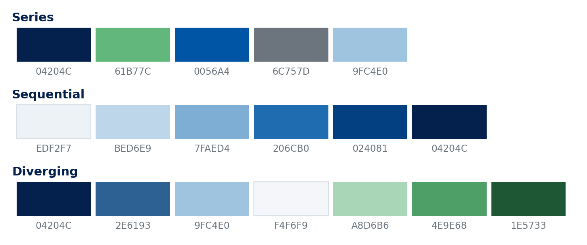

## What This Is

- A modernised Beamer template for academic use, in the tradition of Madrid
  and Berlin: a restrained palette and a layout built for exhibits.
- Written in markdown and rendered by Quarto, or written in LaTeX directly.
  Either way it compiles with pdflatex and needs no fonts installed.
- One deck covers a seminar, a job talk, a conference paper and a lecture.

::: {.takeaway title="The idea"}
Every element on the slides that follow is two or three lines of markdown.
The theme handles the layout, the type and the colour.
:::

## Outline

::: {.toc}
:::

# Writing a Slide

## Headings and Lists

::: {.columns}
::: {.column width="52%"}
- One colour scale for both kinds of list.
    - A second level, quieter.
        - A third, quieter again.

1. Numbered runs the same scale.
    a. Second level.
:::
::: {.column width="44%"}
```markdown
## Headings and Lists

- One colour scale
    - A second level
        - A third

1. Numbered runs the same
    a. Second level
```
:::
:::

`#` opens a section and draws a divider. `##` starts a slide.

## Callout Boxes

::: {.columns}
::: {.column width="52%"}
::: {.takeaway title="Takeaway"}
The claim to remember.
:::

::: {.result}
A finding. Title optional, as here.
:::

::: {.caveat title="Caveat"}
A limitation or an assumption.
:::
:::
::: {.column width="44%"}
::: {.defn title="Term"}
A definition, title inline.
:::

::: {.worked title="Worked example"}
A step taken slowly.
:::

```markdown
::: {.takeaway title="Takeaway"}
The claim to remember.
:::
```
:::
:::

Five types, one shape. Green marks the takeaway, blue a result or worked
example, grey a caveat, navy a definition; a code block takes light grey.

## Headline Numbers

::: {.stats}
- **0.41 s.d.** the effect at the median
- **1 in 4** attenuation from measurement error
- **62,400** unit-years in the panel
:::

```markdown
::: {.stats}
- **0.41 s.d.** the effect at the median
- **1 in 4** attenuation from measurement error
:::
```

Two or three numbers per slide. A fourth is dropped and a warning printed,
because four numbers at this size will not read from the back of a room.

## Numbered Contributions

::: {.contributions}
1. **The first thing the paper does** One sentence saying why it matters,
   set smaller and in the body colour.
2. **The second thing** The numbering comes from the list, so reordering the
   list reorders the slide.
:::

```markdown
::: {.contributions}
1. **The first thing the paper does** One sentence saying why.
2. **The second thing** The numbering comes from the list.
:::
```

# Exhibits

## A Figure

{width=78%}

::: {.tablenotes}
Shaded band is a 95 per cent confidence interval. Notes sit under the
caption, never inside it.
:::

## Two Figures Side by Side

```{=latex}
\figpair
  {examples/trend-treated.png}{Treated Units}
  {examples/trend-control.png}{Control Units}
```

::: {.tablenotes}
Realised path in navy, counterfactual dashed in green. A pair is two exhibits,
so they number separately; put two side by side only when they share a scale.
:::

## A Regression Table

```{=latex}
\tabcaption{Effect of Treatment on the Outcome}
\renewcommand{\arraystretch}{1.0}
\begin{dgtable}{l cccc}
 & \multicolumn{4}{c}{\thead{Dependent Variable: Outcome$_{i,t}$}} \\
\cmidrule{2-5}
 & \multicolumn{2}{c}{\thead{OLS}} & \multicolumn{2}{c}{\thead{IV}} \\
\cmidrule(lr){2-3}\cmidrule(lr){4-5}
 & \thead{(1)} & \thead{(2)} & \thead{(3)} & \thead{(4)} \\
\midrule
\dgpanel{5}{Panel A: Independent Variables}
\hl{Treatment$_{i,t}$} & $0.081$ & $0.115$ & $0.196$ & \hl{$0.188$} \\
                  & (0.027) & (0.031) & (0.058) & (0.064) \\
\midrule
\dgpanel{5}{Panel B: Fixed Effects}
Unit          & \no  & \yes & \yes & \yes \\
Year          & \no  & \no  & \yes & \yes \\
Region--Year  & \no  & \no  & \no  & \yes \\
\midrule
\dgpanel{5}{Panel C: Model Summary Statistics}
First-stage $F$ & --- & --- & 38.4 & 27.6 \\
Observations & 62{,}400 & 62{,}400 & 62{,}400 & 62{,}118 \\
\end{dgtable}
```

::: {.tablenotes}
Treatment is instrumented in columns (3) and (4); fixed effects saturate left
to right. Standard errors clustered by unit.
:::

## Equations

$$
  y_{it} = \alpha_i + \delta_t + \beta D_{it}
    + \gamma \sum_{j \neq i} w_{ij} D_{jt} + \varepsilon_{it}
$$

Display maths is numbered, like tables and figures, with the counter running
across the whole deck.

::: {.caveat}
Wrap an equation in `::: {.nonumber}` when it should not carry a number.
:::

# Navigating and Teaching

## Appendix Jumps {#main}

Three levels of emphasis. Level one is green: use it for the slide you most
expect to be asked about, and the quieter levels for the rest. The
destination is an ordinary heading id, and `.back` marks a return button.

Appendix slides sit after the closing slide and number in Roman, so a long
appendix does not inflate the page count the audience sees during the talk.

```markdown
## Robustness {#rob}

::: {.nav}
- [Robustness](#rob)
- [Identification](#ident){.level2}
- [Data](#data){.level3}
:::
```

::: {.nav}
- [Robustness](#rob)
- [Identification](#ident){.level2}
- [Data](#data){.level3}
:::

## Contents, Handouts and Notes

::: {.columns}
::: {.column width="50%"}
**A contents slide.** `::: {.toc}` under an `## Outline` heading. Entries are
live links, so a reader can jump to a section.

**Speaker notes.** `::: {.notes}` stays out of the projected deck.
:::
::: {.column width="46%"}
**Handouts**, two or four slides to an A4 page:

```yaml
format:
  dublin-beamer:
    classoption: [t, handout]
    include-in-header:
      text: |
        \handouttwoup
```
:::
:::

## References

Citations run through citeproc, so a Zotero export works directly
[@angrist2009; @cameron2015; @callaway2021]. Point the front matter at a CSL
style and the list is set for you.

```yaml
bibliography: refs.bib
csl: https://www.zotero.org/styles/apa
```

Put `::: {#refs}` wherever you want the list, rather than letting it fall
where pandoc drops it. This deck puts it last, past the appendix.

# The Theme Itself

## Palette

```{=latex}
\tabcaption{The Palette}
\begin{dgtable}{l l l}
\thead{Token} & \thead{Hex} & \thead{Reserved For} \\
\midrule
\swatch{dgNavy}  Navy      & \texttt{04204C} & Headings, cover ground \\
\swatch{dgBlue}  Blue      & \texttt{0056A4} & Structure, links, section labels \\
\swatch{dgGreen} Green     & \texttt{61B77C} & Badge, takeaway bar, list level 1 \\
\swatch{dgInk}   Ink       & \texttt{212529} & Body text \\
\swatch{dgMuted} Muted     & \texttt{6C757D} & Footer, notes, third-level markers \\
\end{dgtable}
```

::: {.caveat}
Change these five tokens at the top of `dublin-theme.tex` and the whole deck
follows: the boxes, the rules and the nav buttons all read from them. **Use
the green sparingly** — it leads a list and marks the takeaway, and it stops
meaning anything once it is on every slide.
:::

## Type

IBM Plex throughout: **Sans** for the slide, **Mono** for code, and Plex for
maths rather than Computer Modern.

- Sans serif, so it holds at the back of a room.
- Ships in TeX Live, so nothing needs installing — Overleaf included.
- Has a maths version, so equations match the prose.
- Contemporary, and distinct from Beamer's default Computer Modern.

$$ \widehat{\beta} = (X'X)^{-1}X'y $$

## Colour for Figures

{width=74%}

::: {.tablenotes}
`examples/dublin-mpl.py` and `examples/dublin-ggplot.R` carry these plus the
drawing conventions: axis labels in navy, ticks in grey, two spines, no grid,
and a confidence band in the line's own colour at 16 per cent.
:::

## Start a Deck

::: {.columns}
::: {.column width="52%"}
```yaml
---
title: "Your Paper"
subtitle: "The Subtitle"
author: "Your Name"
institute: "Your Institution"
date: "September 2026"
format: dublin-beamer

cover-photo: photo.png
cover-badge: Job Market Paper
cover-logo: crest.png
qr-code: qr.png
---
```
:::
::: {.column width="44%"}
Copy `_extensions/` into the folder, then `quarto render talk.qmd`.

::: {.result title="Widescreen by default"}
Beamer still opens at 4:3; projectors and screens are widescreen. Override
the format for the rare room that needs a square screen:
:::

```yaml
format:
  dublin-beamer:
    aspectratio: 43
```
:::
:::

## What Ships With It

::: {.columns}
::: {.column width="50%"}
**`example.qmd`** a talk skeleton to copy and fill in: motivation, design,
results, appendix.

**`stress.qmd`** every element at its limit — a four-line title, an empty
frame, a table taller than a slide.
:::
::: {.column width="46%"}
**`tests/check.py`** assertions over the built PDF — frame overflow, dangling
jump links, gaps in the exhibit numbering, off-palette colour, captions out
of Title Case.

**`tests/build.sh`** builds either deck and checks it.
:::
:::

::: {.result}
Run it after you change the theme. A slide that has run past the footer still
compiles, and a jump button pointing at a renamed label still renders, so
neither shows up in a screenshot.
:::

## {.plain}

::: {.thanks email="sam.deegan@ucdconnect.ie" site="sam-deegan.com"}
:::

## {.plain}

::: {.appendix}
:::

## Data {#data}

- Sources, and the period each one covers.
- How the sample was built, and what it drops.
- Variable definitions.

::: {.nav}
- [Back](#main){.back}
:::

## Robustness {#rob}

- Alternative specifications.
- Rolling windows.
- Placebo distribution.

::: {.nav}
- [Back](#main){.back}
- [Identification](#ident){.level3}
:::

## Identification {#ident}

A level-three destination: detail kept to hand but rarely needed.

::: {.nav}
- [Back](#main){.back}
- [Robustness](#rob){.level2}
:::

## References {.allowframebreaks}

::: {#refs}
:::
