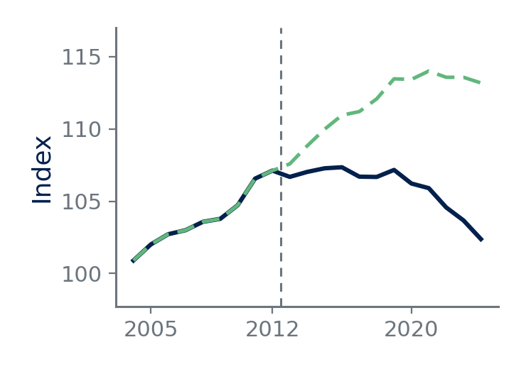

## A Frame Title Long Enough to Wrap Onto a Second Line and Test the Rule Beneath It

- One bullet.

## Everything on One Frame

::: {.takeaway title="A title and a body"}
A takeaway with a title.
:::

::: {.result}
A result with no title.
:::

::: {.caveat title="With a title"}
A caveat, titled, to check the title styling is not takeaway-only.
:::

## A Frame With No Content

## Lists Nested to the Limit

Three levels is the limit; a fourth is a LaTeX error, not a styling gap.

- One
    - Two
        - Three
- Back to one

1. One
    a. Two
        i. Three
2. Back to one

## Two Equations, One Suppressed

$$ y_{it} = \alpha_i + \delta_t + \beta x_{it} + \varepsilon_{it} $$

::: {.nonumber}
$$ \widehat{\beta} \xrightarrow{p} \beta + \frac{\mathrm{Cov}(x, \varepsilon)}{\mathrm{Var}(x)} $$
:::

$$ \mathbb{E}[y \mid x] = \int_{-\infty}^{\infty} y f(y \mid x)\,\mathrm{d}y $$

## A Table at the Height Limit

| Specification | Treatment | Lagged Outcome | Units | Years |
|:--------------|-------------:|-------------------:|---------:|------:|
| OLS | $0.081$ | | 2,400 | 26 |
| OLS, lags | $0.115$ | | 2,400 | 26 |
| IV | $0.196$ | $0.093$ | 2,400 | 26 |
| IV, saturated | $0.188$ | $0.088$ | 2,400 | 26 |
| IV, region-year | $0.174$ | $0.081$ | 2,391 | 26 |
| IV, subsample | $0.242$ | $0.140$ | 1,180 | 12 |
| IV, placebo | $0.003$ | $-0.001$ | 2,400 | 26 |

: A Table With More Rows Than a Frame Comfortably Holds

::: {.tablenotes}
Standard errors clustered by unit. This notes block runs to two lines so
that the frame is genuinely full, which is the point of the test.
:::

## A Markdown Table With One Column

| Variable |
|:---------|
| Outcome, in standard deviations |
| Outcome, in levels |

: A Degenerate Table

## Stats With Two Rather Than Three

::: {.stats}
- **0.41 s.d.** the effect at the median
- **1 in 4** attenuation from measurement error
:::

## Stats With One

::: {.stats}
- **0.41 s.d.** the effect at the median
:::

## A Figure Wider Than It Is Tall

{width=60%}

::: {.tablenotes}
The notes block sits under the caption, not inside it.
:::

# A Section Whose Name Is Long Enough to Wrap on the Divider Slide

## Navigation to Every Level {#main}

::: {.nav}
- [Level one](#one)
- [Level two](#two){.level2}
- [Level three](#three){.level3}
:::

## A Box Alias Test

::: {.finding title="Alias for result"}
Written as `.finding`.
:::

::: {.limitation}
Written as `.limitation`.
:::

::: {.example title="Alias for worked"}
Written as `.example`.
:::

## {.plain}

::: {.thanks email="sam.deegan@ucdconnect.ie" site="sam-deegan.com"}
:::

## {.plain}

::: {.appendix}
:::

## Level One {#one}

Reached from the main frame.

::: {.nav}
- [Back](#main){.back}
:::

## Level Two {#two}

::: {.nav}
- [Back](#main){.back}
:::

## Level Three {#three}

::: {.nav}
- [Back](#main){.back}
- [Level two](#two){.level2}
:::
